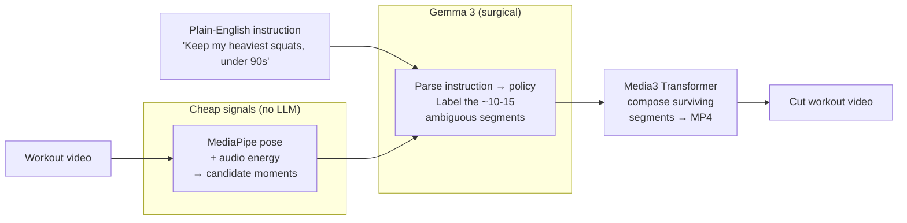
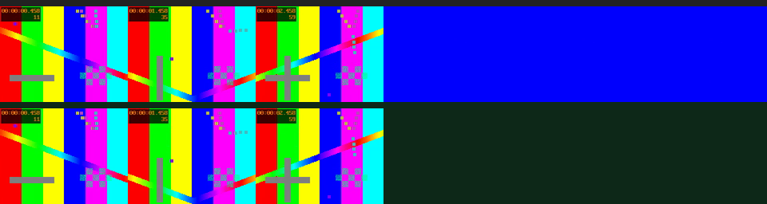

# WorkoutAutoEditor

[](https://github.com/Amarel-Taylor-Scott/WorkoutAutoEditor/actions/workflows/android.yml)
[](https://github.com/Amarel-Taylor-Scott/WorkoutAutoEditor/actions/workflows/python.yml)
[](#tests)
[](LICENSE)

**Edit a workout video by describing the cut you want — and everything runs
offline, on your phone.** No upload, no cloud GPU, no per-frame VLM bill.

You film a session and type something like:

> *"Keep my heaviest squats and presses, drop everything else, under 90 seconds total."*

The app turns that one sentence into a finished, cut-down video — entirely
on-device:

1. **MediaPipe** estimates pose across the clip and finds the moments that matter
   (which exercise, which rep, working set vs. warmup vs. rest).
2. **Gemma 3** reasons about the edit — it parses your plain-English instruction
   into a structured policy, and labels the handful of segments the cheap signals
   can't decide on their own.
3. **Android Media3** composes the surviving segments into a single MP4 using the
   phone's hardware encoder.

The only network call is a one-time model download on first launch. After that
it works in airplane mode.

## Why this is the right architecture

The obvious approach — feed every frame of a 10-minute workout to a vision LLM —
is wrong on three counts: it would drain a Pixel in under 20 minutes, take 20-40
minutes of pure inference per clip, and produce results no better than cheap
signals already give. So the LLM is treated as a **surgical tool**, not a
firehose: pose landmarks and audio energy do the structural work, and Gemma is
invoked only on the ~10-15 most ambiguous segments. That is what makes a fully
on-device edit feasible on consumer hardware.

Full design rationale, layer-by-layer, in [`ARCHITECTURE.md`](ARCHITECTURE.md).

## Pipeline at a glance

The same idea drives both sides of the repo: cheap signals do the structural
work, the LLM is a surgical tool, and the render is hardware-accelerated.



On the Android side the render is **Media3 Transformer**; on the desktop
`vidcut` side it is **ffmpeg**, and the moment-finding is ffmpeg scene/silence
detection instead of MediaPipe — but the shape (signals → small-LLM edit
decision → render) is identical.

## Demo

Here is `vidcut` run for real on the bundled `desktop/samples/test.mp4` — a 6.0s
clip cut down to 3.0s by a local Gemma 4 model deciding which segment to keep.
Everything below was produced on-device, no cloud calls. The sample is a
synthetic test pattern (it ships in-repo so the demo is reproducible), so the
"footage" is color bars — the point is the edit decision, not the content.



<sub>Top row = the full 6s input filmstrip. Bottom row = the 3s the model kept
(0–3s), dropping the dead-air tail. Rendered output as a GIF:
[`docs/demo/vidcut-demo.gif`](docs/demo/vidcut-demo.gif).</sub>

**One-command demo** (needs `ffmpeg`/`ffprobe` on PATH and
[Ollama](https://ollama.com) running a Gemma model):

```bash
cd desktop
pip install -e .
ollama serve &                       # in another terminal
ollama pull gemma3:1b                 # small + fast; any Gemma tag works
VIDCUT_MODEL=gemma3:1b vidcut edit samples/test.mp4 -o out.mp4 \
    -p "Keep the most active moments, drop dead air" --threshold 0.15
```

The model's own reasoning shows up in the printed plan's `Rationale` /
`Summary` columns. The full transcript of the run that produced the artifacts
above is in [`docs/demo/transcript.txt`](docs/demo/transcript.txt).

> **App screenshots / on-device screen recording: TODO** — capturing the
> Android UI end-to-end needs a physical device or emulator (MediaPipe + Gemma
> + MediaCodec don't run in CI). The `vidcut` demo above is the runnable proof
> of the shared pipeline.

## What it does

You film a workout. You type a plain-English instruction. The app parses it into
a structured policy, asks you to confirm, then runs:

1. **Pose pass** — MediaPipe Pose Landmarker over the clip at 5 fps
2. **Audio pass** — RMS envelope for set-boundary detection
3. **Timeline build** — windowed exercise classification + per-rep state machines
4. **Keyframe review** — Gemma annotates a small set of ambiguous segments
5. **Cut-list** — six-stage pipeline applies your policy
6. **Render** — Media3 Transformer composes the surviving segments

Roughly 3-5 minutes of processing for a 10-minute clip on a Pixel 8 Pro plugged
in (per-stage budget in `ARCHITECTURE.md`).

```
Setup -> Home -> Record -> Plan -> Review -> Process -> Done
```

The pipeline is a service-bound state machine
(`IDLE -> PARSING -> AWAITING_CONFIRMATION -> PROCESSING -> DONE/FAILED`) so the
UI can gate on a confirmation step: cheap parse first, user confirms, heavy work
follows.

## Two repos, one idea

- **`app/`** — the Android app described above (Kotlin + Jetpack Compose).
- **`desktop/`** — `vidcut`, a cross-platform sibling that runs the same
  prompt-driven editing idea on a laptop (Python + Ollama + ffmpeg). Faster to
  iterate, not limited to workouts. See [`desktop/README.md`](desktop/README.md).

## Algorithm highlights

- **Pose embeddings** — each frame becomes a 40-dim normalized vector
  (hip-midpoint origin for translation invariance, torso-size scaling for scale
  invariance; (dx, dy) for 20 hand-picked joint pairs so directional cues like
  *wrist-above-shoulder* survive).
- **k-NN with a confidence floor** — weighted k-NN (k=10, inverse-distance). If
  even the closest training sample is too far, it returns `UNKNOWN` rather than
  confidently mislabeling, and the pipeline falls back to rules.
- **Six-stage cut list** — filter by class -> drop low-rep/low-quality ->
  group/warmup handling -> per-exercise cap -> merge & pad -> trim to target.
  Each stage has explicit rules; see `CutListBuilder.kt`.
- **Sequential model lifecycle** — Gemma, MediaPipe, and MediaCodec are opened
  and closed one at a time, keeping peak memory under ~3 GB.

## Tests

This is the most thoroughly tested piece of the stack — the algorithmic core is
covered on both sides without requiring a device or a full build:

- **Kotlin (Android)** — 22 unit tests via Robolectric across the cut-list
  builder, rep detector, pose embedder, k-NN classifier, plus UI smoke tests.

  ```bash
  ./gradlew :app:testDebugUnitTest        # or: ./gradlew test
  ```

- **Python (vidcut)** — 56 tests covering JSON/plan parsing, the fallback
  policy, the editor graph, and the pydantic schemas. They don't hit Ollama or
  ffmpeg.

  ```bash
  cd desktop
  pip install -e . pytest
  pytest
  ```

Both suites also run in CI on every push
(`.github/workflows/android.yml`, `.github/workflows/python.yml`); the Python
suite runs across Python 3.10-3.12 on Linux, macOS, and Windows.

## Build (Android)

Easiest path is CI — push and download the `WorkoutAutoEditor-debug-apk`
artifact from the Actions run.

To build locally, install JDK 17 + Android cmdline-tools +
`platforms;android-35` and `build-tools;35.0.0`, then:

```bash
./gradlew :app:assembleDebug
```

APK lands at `app/build/outputs/apk/debug/app-debug.apk`.

### Two things to know up front

1. **First launch downloads the Gemma model** (large; ~hundreds of MB to ~2 GB
   depending on variant). Wi-Fi only is recommended. The user's Hugging Face
   token (only needed for gated models) is entered at runtime and stored in
   `EncryptedSharedPreferences` backed by the Android Keystore — it is never in
   this repo.
2. **CI auto-populates `pose_landmarker_full.task`** into `app/src/main/assets/`
   before each build. For local builds, fetch that file yourself — the URL is in
   `app/src/main/assets/README.txt` and `.github/workflows/android.yml`. Model
   blobs (`*.task`, `*.tflite`, `*.bin`, the Gemma model) are deliberately
   **not** committed; they are fetched separately.

## What's not in the box

- **A canonical training set** — the Training screen is wired up, but you provide
  samples. Without training, the rule-based classifier handles
  squat / pushup / curl / press.
- **Production signing** — debug builds use the auto-generated debug keystore for
  sideloading. For a Play Store release, supply a real keystore via a gitignored
  `keystore.properties` and wire it into `app/build.gradle.kts`.

## License

MIT — see [`LICENSE`](LICENSE).
